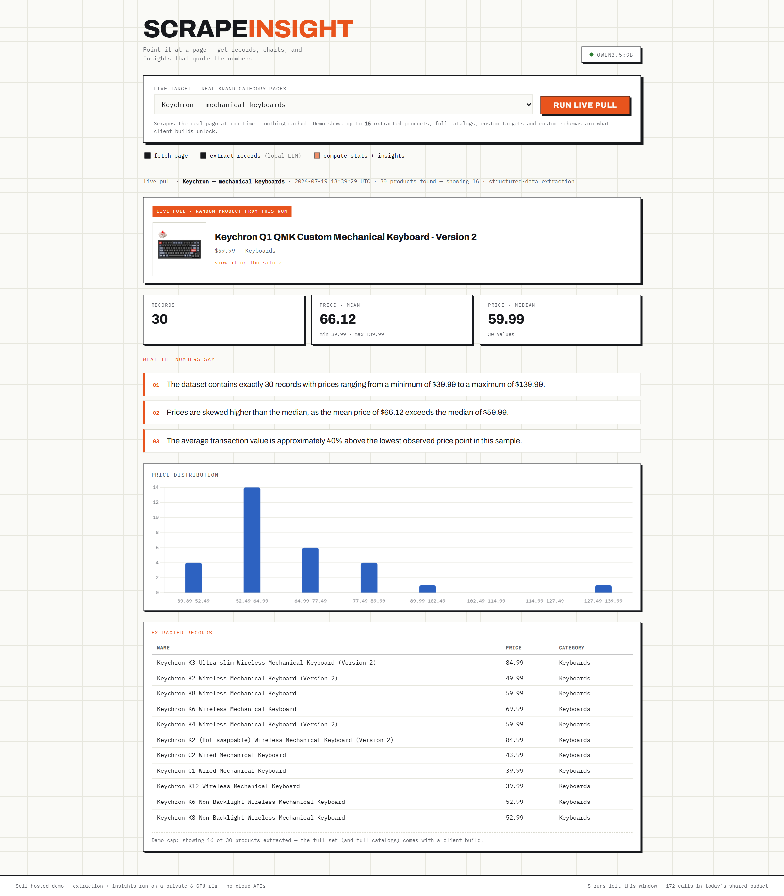
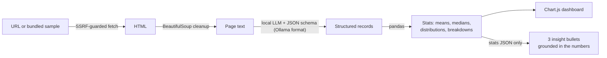

# ScrapeInsight — point it at a page, get data

Give it a URL. A local LLM extracts **structured records** (schema-enforced JSON — products, posts, whatever the preset defines), pandas computes the statistics, Chart.js draws them, and the model writes three insight bullets that are **only allowed to quote the computed numbers**. Scrape → dataset → dashboard in one run, entirely on self-hosted hardware.

> **Live demo:** _URL coming after deploy_ · Built and served from a 6-GPU home rig.



## How it works



The division of labor is deliberate: **the LLM does language, the code does math.** Extraction is constrained by a JSON schema (Ollama's `format` parameter), all statistics come from pandas, and the insight prompt receives only the computed stats — so every number in the narration is one the code produced, not one the model invented.

## Engineering notes

- **SSRF guard on every hop.** This runs inside a private network, so user-supplied URLs are dangerous by default. Each fetch (including every redirect) validates scheme, port, and credentials, resolves DNS, and requires every resolved address to be globally routable — loopback, RFC1918, link-local (cloud metadata!) and reserved ranges are rejected. 14 denial tests assert both the block *and* the reason.
- **Hard resource caps.** 2 MB response cap enforced while streaming, fetch timeouts, redirect limit, page-text truncation, record cap.
- **Built to be public.** Per-IP rate limits, a persisted daily LLM budget that fails closed, CSP + security headers, XSS-safe rendering.
- **Progress over SSE.** Fetch → extract → analyze stages stream to the UI, so a 30-second run never looks frozen (and never trips proxy idle timeouts).
- **Bundled samples.** Two self-authored sample pages let anyone try it without scraping a third party.

## Stack

FastAPI · BeautifulSoup · pandas · Ollama (schema-constrained output) · Chart.js · vanilla JS frontend · pytest

## Run it

```bash
ollama pull qwen2.5:7b-instruct

python -m venv .venv && .venv/bin/pip install -r requirements.txt
cp .env.example .env          # point OLLAMA_URL at your instance
.venv/bin/python run.py       # → http://127.0.0.1:8902
```

## API

| Route | What it does |
|---|---|
| `POST /api/analyze` | `{url | sample, preset}` → SSE: `progress`×n, then `result` with records + stats + charts + insights |
| `GET /api/presets` | available extraction presets and bundled samples |
| `GET /api/health` | backend + model readiness |
| `GET /api/limits` | remaining quota for the caller |

Presets are declarative (`app/schemas.py`): a JSON schema for extraction plus which fields are numeric/categorical for analysis. Adding a new page type is ~15 lines.

## Tests

```bash
.venv/bin/python -m pytest tests -q   # 31 tests: SSRF guard, stats, API flow, rate limits, headers
```

The suite runs with a mocked LLM — no GPU needed. The SSRF tests assert rejections happen *for the right reason* (a metadata IP must be blocked as private, not by a parsing accident).

---

*Part of a portfolio of self-hosted AI tools. Questions or a similar build in mind? Get in touch.*
